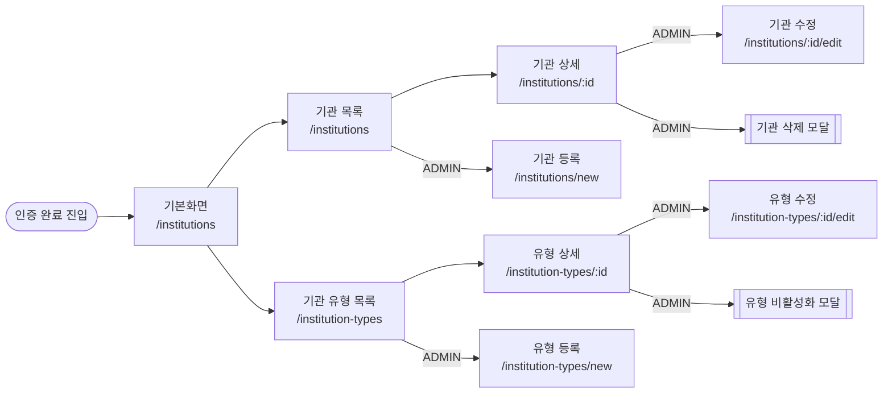

# UI Mockups — institution-ui

본 문서는 institution-ui의 전 화면 목업 인덱스입니다.
각 화면별 **경로 / 접근 권한 / 목적 / 주요 구성 / 연관 기능 명세**를 함께 기술합니다.

> **전제**: 로그인 / 회원가입 / 로그아웃 / 세션 관리는 **별도 인증 모듈**에서 처리합니다.
> 본 모듈은 **인증 완료(로그인 상태) 후 진입**하는 것을 전제로 하며, 인증 화면은 본 문서 범위에서 제외합니다.

---

## 화면 플로우 (본 모듈 범위)

---

## 0. 기본 화면 (진입 대시보드)

- **경로**: `/institutions` (인증 모듈로부터 리다이렉트되는 기본 랜딩)
- **접근**: USER / ADMIN (인증 모듈에서 보장)
- **목적**: 인증 완료 후 진입하는 메인 화면. 기관 목록을 기본 뷰로 노출.
- **주요 구성**: 글로벌 네비게이션 바 + 기관 목록 테이블
- **연관 문서**: [기능명세 § 4, § 5.1](../functional-specification-ui.md)

---

## 1. 공통 네비게이션 바

> 네비게이션 바는 모든 화면에 공통 포함되어 있습니다. 아래 기관 목록 목업에서 확인할 수 있습니다.

- **표시 조건**: 본 모듈 전 화면 (인증 모듈 화면은 자체 레이아웃 사용)
- **주요 구성**
  - 좌측: 로고 + "연구기관 관리" (→ `/institutions`)
  - 중앙: "기관 목록", "기관 유형" (현재 경로 하이라이트)
  - 우측: 사용자명, role 뱃지(USER=회색, ADMIN=파란색), 로그아웃 버튼
- **로그아웃 버튼**: 클릭 시 **인증 모듈**에 위임 (본 모듈은 트리거만 제공)
- **연관 문서**: [기능명세 § 4](../functional-specification-ui.md#4-네비게이션-바)

---

## 2. 기관 관리

### 2.1 기관 목록

> **목업**: [institutions-list.html](./institutions-list.html)

- **경로**: `/institutions`
- **접근**: USER / ADMIN
- **주요 구성**: 테이블(기관명, 코드, 유형, 대표자, 설립일), ADMIN 한정 `+ 기관 등록` 버튼
- **핵심 동작**
  - 행 클릭 → `/institutions/{id}`
  - 빈 상태 → "등록된 기관이 없습니다"
- **연관 문서**: [기능명세 § 5.1](../functional-specification-ui.md#51-기관-목록)

### 2.2 기관 상세

> **목업**: [institution-detail.html](./institution-detail.html)

- **경로**: `/institutions/[id]`
- **접근**: USER / ADMIN
- **주요 구성**: 기관 메타 전체 필드(유형·주소·연락처·대표자·설립일·등록/수정일), ADMIN 한정 `수정`·`삭제` 버튼
- **핵심 동작**: 404 시 빈 상태 + 목록으로 돌아가기
- **연관 문서**: [기능명세 § 5.2](../functional-specification-ui.md#52-기관-상세)

### 2.3 기관 등록

> **목업**: [institution-new.html](./institution-new.html)

- **경로**: `/institutions/new`
- **접근**: ADMIN 전용
- **주요 구성**: 기관명·코드·유형(드롭다운)·주소·전화·이메일·홈페이지·대표자·설립일 폼
- **핵심 검증**: 코드 `^[A-Z0-9_-]+$`, 이메일/URL 형식, 기관명 ≤200자
- **핵심 동작**
  - 201 → 상세 페이지 이동 + "등록되었습니다"
  - 409 DUPLICATE_INSTITUTION_CODE → code 인라인 에러
  - 400 INSTITUTION_TYPE_INACTIVE → 유형 인라인 에러
- **연관 문서**: [기능명세 § 5.3](../functional-specification-ui.md#53-기관-등록)

### 2.4 기관 수정

> **목업**: [institution-edit.html](./institution-edit.html) (409 에러 예시 포함)

- **경로**: `/institutions/[id]/edit`
- **접근**: ADMIN 전용
- **주요 구성**: 등록 폼과 동일, 진입 시 기존 값 로드
- **핵심 동작**: `PUT` 전체 교체 → 성공 시 상세로 이동
- **연관 문서**: [기능명세 § 5.4](../functional-specification-ui.md#54-기관-수정)

### 2.5 기관 삭제 확인 모달

> **목업**: [institution-delete-modal.html](./institution-delete-modal.html)

- **트리거**: 상세 화면 `삭제` 버튼
- **주요 구성**: 기관 코드·기관명 재입력 필드, 경고 문구, 취소/삭제 버튼
- **핵심 동작**
  - 200 → `/institutions` 이동 + "삭제되었습니다"
  - 409 DELETE_MISMATCH → 모달 내 "삭제 확인 정보가 일치하지 않습니다"
  - ESC / 배경 클릭 → 모달 닫기
- **연관 문서**: [기능명세 § 5.5](../functional-specification-ui.md#55-기관-삭제-확인-모달)

---

## 3. 기관 유형 관리

### 3.1 유형 목록

> **목업**: [types-list.html](./types-list.html) (성공 배너 예시 포함)

- **경로**: `/institution-types`
- **접근**: USER / ADMIN
- **주요 구성**: 테이블(코드·명칭·설명·정렬·활성), ADMIN 한정 `+ 유형 등록`
- **연관 문서**: [기능명세 § 6.1](../functional-specification-ui.md#61-유형-목록)

### 3.2 유형 상세

> **목업**: [type-detail.html](./type-detail.html)

- **경로**: `/institution-types/[id]`
- **주요 구성**: 전체 필드 라벨-값, ADMIN 한정 `수정`·`비활성화`
- **연관 문서**: [기능명세 § 6.2](../functional-specification-ui.md#62-유형-상세)

### 3.3 유형 등록

> **목업**: [type-new.html](./type-new.html)

- **경로**: `/institution-types/new`
- **접근**: ADMIN 전용
- **주요 구성**: code·name·description·sortOrder 폼
- **핵심 동작**: 409 DUPLICATE_INSTITUTION_TYPE_CODE → code 인라인 에러
- **연관 문서**: [기능명세 § 6.3](../functional-specification-ui.md#63-유형-등록)

### 3.4 유형 수정

> **목업**: [type-edit.html](./type-edit.html)

- **경로**: `/institution-types/[id]/edit`
- **접근**: ADMIN 전용
- **주요 구성**: 등록 폼과 동일 (`PUT` 전체 교체)
- **연관 문서**: [기능명세 § 6.4](../functional-specification-ui.md#64-유형-수정)

### 3.5 유형 비활성화 모달

> **목업**: [type-deactivate-modal.html](./type-deactivate-modal.html)

- **트리거**: 상세 화면 `비활성화` 버튼
- **주요 구성**: 비활성화 후 영향 안내(신규 등록 불가 / 기존 참조 유지), 취소/비활성화 버튼
- **핵심 동작**: 성공 → 목록 이동 + "비활성화되었습니다"
- **연관 문서**: [기능명세 § 6.5](../functional-specification-ui.md#65-유형-비활성화-확인-모달)

---

## 4. 인증 연계 (본 모듈 경계)

본 모듈은 아래 상호작용만 수행하며, 화면·플로우는 **인증 모듈** 책임입니다.

| 상황 | 본 모듈 동작 |
|------|-------------|
| 미인증 상태로 본 모듈 경로 접근 | 인증 모듈 로그인 화면으로 위임 |
| 세션 만료 (API 401) | 인증 모듈로 리다이렉트 + "다시 로그인해 주세요" 알림 |
| 권한 부족 (API 403) | `/institutions`로 리다이렉트 + "접근 권한이 없습니다" 알림 |
| 로그아웃 버튼 클릭 | 인증 모듈 로그아웃 API 호출 위임 |

---

## 5. 공통 UI 상태

| 상태 | 표시 방식 |
|------|----------|
| 필드 검증 실패 | 필드 하단 빨간 텍스트 |
| API 400 (필드별) | 해당 필드 하단 매핑 |
| API 401 | 인증 모듈로 위임 (위 § 4 참조) |
| API 403 | 상단 빨간 배너 + 리다이렉트 |
| API 404 | 빈 상태 컴포넌트 |
| API 500 | 상단 빨간 배너 (자동 소멸 없음) |
| 성공 | 상단 초록 배너, 3초 자동 소멸 |
| 로딩 (페이지) | 중앙 스피너 / 스켈레톤 |
| 로딩 (버튼) | 비활성 + "처리 중…" |

> 상세 규칙은 [기능명세 § 7 ~ § 9](../functional-specification-ui.md#7-알림--에러-표시-규칙) 참조.

---

## 목업 파일 목록

| 화면 | 파일 | 경로 | 권한 |
|------|------|------|------|
| 기관 목록 | [institutions-list.html](./institutions-list.html) | `/institutions` | USER / ADMIN |
| 기관 상세 | [institution-detail.html](./institution-detail.html) | `/institutions/:id` | USER / ADMIN |
| 기관 등록 | [institution-new.html](./institution-new.html) | `/institutions/new` | ADMIN |
| 기관 수정 | [institution-edit.html](./institution-edit.html) | `/institutions/:id/edit` | ADMIN |
| 기관 삭제 모달 | [institution-delete-modal.html](./institution-delete-modal.html) | — | ADMIN |
| 유형 목록 | [types-list.html](./types-list.html) | `/institution-types` | USER / ADMIN |
| 유형 상세 | [type-detail.html](./type-detail.html) | `/institution-types/:id` | USER / ADMIN |
| 유형 등록 | [type-new.html](./type-new.html) | `/institution-types/new` | ADMIN |
| 유형 수정 | [type-edit.html](./type-edit.html) | `/institution-types/:id/edit` | ADMIN |
| 유형 비활성화 모달 | [type-deactivate-modal.html](./type-deactivate-modal.html) | — | ADMIN |

> 공통 스타일: [`mockup-style.css`](./mockup-style.css) · 전체 모아보기: [`samples.html`](./samples.html)

---

## 파일 규칙

- 파일명: 영문 소문자 + 하이픈 (예: `institution-detail.html`)
- 새 화면 추가 시 본 README의 해당 섹션·목업 파일 목록·플로우 다이어그램 함께 갱신

---

## 관련 문서

| 문서 | 위치 |
|------|------|
| 기능 명세 (화면·API 계약) | [`../functional-specification-ui.md`](../functional-specification-ui.md) |
| SRS | [`../SRS-ui.md`](../SRS-ui.md) |
| UI 디자인 플랜 | [`../ui-design-plan.md`](../ui-design-plan.md) |
| 기관 정보 문서 | [`../institution_INFO-ui.md`](../institution_INFO-ui.md) |